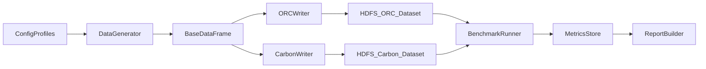

# План разработки приложения сравнения ORC и CarbonData

## Цели и результаты
- Построить репозиторий с Spark 3 приложением на Java 18 для:
  - генерации синтетического датасета объемом ~5 ТБ в HDFS;
  - записи одинаковых данных в форматы ORC и CarbonData;
  - запуска набора бенчмарков и интеграционных тестов;
  - сбора метрик: время записи/чтения, размер на диске, эффективность фильтрации и индексов.
- Обеспечить воспроизводимость экспериментов через конфигурационные профили и фиксированные seed.

## Область работ (MVP)
- Один исполняемый Spark job runner с режимами: `generate`, `write-orc`, `write-carbon`, `benchmark`, `report`.
- Генерация набора данных с колонками:
  - **низкая кардинальность** (например, 10-100 уникальных значений);
  - **средняя кардинальность** (10K-1M);
  - **высокая кардинальность** (уникальные или почти уникальные значения).
- Обязательные технические поля в схеме:
  - `timestamp` (временная метка события для time-based партиционирования и range-фильтров);
  - `log_format` (тип/формат записи лога для запуска разных тестовых профилей).
- Отдельные сценарии запросов под:
  - scan + projection;
  - filter pushdown;
  - point/range/IN-фильтры;
  - сценарии, где ожидается эффект Bloom/Lucene;
  - сравнение производительности для разных значений `log_format`.

## Архитектура решения
- `core-config`: загрузка конфигов (объем, schema profile, число партиций, компрессия, настройки форматов).
- `data-generator`: создание DataFrame с контролируемыми распределениями, кардинальностью, `timestamp` и вариантами `log_format`.
- `writers`:
  - ORC writer (spark options, partitioning, compression);
  - CarbonData writer (таблицы/индексы, параметры Lucene/Bloom).
- `benchmarks`:
  - библиотека тест-кейсов с единым интерфейсом;
  - warm-up + N повторов;
  - сбор latency, throughput, scanned bytes.
- `reporting`: агрегирование результатов в Parquet/CSV/JSON + Markdown-отчет.
- `validation`: проверки корректности данных и эквивалентности результатов ORC vs CarbonData.

## Поток данных

## Дизайн синтетических данных (~5 ТБ)
- Схема (пример):
  - `event_id` (high cardinality), `user_id` (high), `session_id` (high);
  - `country_code` (low), `device_type` (low), `status` (low);
  - `product_id` (medium), `campaign_id` (medium), `region_id` (medium);
  - `timestamp`, `amount`, `payload_json` (полуструктурированная нагрузка);
  - `log_format` (например: `json`, `plain_text`, `key_value`, `apache_common`).
- Профили `log_format`:
  - компактный структурированный JSON;
  - строковый plain-text лог;
  - `key=value` формат;
  - веб-логоподобный формат для полнотекстового поиска.
- Распределения:
  - low: фиксированный словарь;
  - medium: Zipf/равномерное распределение с параметризуемым skew;
  - high: UUID/sequence-based значения.
- Стратегия генерации 5 ТБ:
  - генерация чанками (например, по дате/бакету), чтобы не упираться в память;
  - параметр `target_size_tb` и автооценка числа строк по средней длине строки;
  - генерация временного диапазона `timestamp` с контролем интенсивности событий по времени;
  - контроль output file size (примерно 256-512 MB на файл) через partition/repartition.

## Настройки форматов и индексов
- ORC:
  - включить predicate pushdown, vectorized reader;
  - сравнить 2-3 варианта compression (Snappy/ZSTD).
- CarbonData:
  - baseline без вторичных индексов;
  - сценарий с Bloom index на средне/высококардинальных ключах для point lookup;
  - сценарий с Lucene index для текстовых/поисковых фильтров.
- Все сравнения выполнять на идентичном исходном датасете и сопоставимых настройках партиционирования.

## Набор тестов
- **Корректность данных**:
  - row count parity (source vs ORC vs Carbon);
  - checksum/hash по ключевым колонкам;
  - выборочные сравнения результатов запросов.
- **Функциональные тесты генератора**:
  - проверка ожидаемой кардинальности по колонкам;
  - проверка распределения значений в заданных пределах;
  - проверка валидности `timestamp` (диапазон, монотонность в бакетах, полнота по интервалам);
  - проверка долей и структуры значений `log_format`;
  - повторяемость при фиксированном seed.
- **Производительные тесты**:
  - write throughput и write latency;
  - read scan (full/partial), selective filters, group-by;
  - time-range фильтры по `timestamp`;
  - селективные и смешанные фильтры по `log_format`;
  - cold-start и warm-cache прогоны.
- **Индексные тесты**:
  - point lookup по high/medium cardinality колонкам;
  - текстовые фильтры/contains для Lucene в разрезе каждого `log_format`;
  - сравнение with-index vs without-index.

## Метрики и критерии приемки
- Метрики:
  - `write_time_sec`, `read_p50/p95_sec`, `throughput_mb_s`;
  - `dataset_size_gb`, `compression_ratio`;
  - `rows_scanned`, `rows_returned`, `selectivity`;
  - `time_filter_selectivity`, `log_format_selectivity`;
  - `index_build_time`, `index_storage_overhead`.
- Критерии приемки MVP:
  - генерация и запись 5 ТБ завершается без ошибок;
  - все тесты корректности проходят;
  - отчеты автоматически строятся по каждому сценарию;
  - есть воспроизводимый запуск одним набором команд.

## Этапы реализации
1. **Каркас проекта**: Maven/Gradle, Spark job entrypoint, типизированный конфиг.
2. **Генератор данных**: схема, кардинальности, `timestamp`, `log_format`, распределения, chunked write.
3. **Запись в ORC/CarbonData**: отдельные пайплайны и параметризуемые опции.
4. **Бенчмарк-раннер**: каталог запросов (включая time-range и log_format сценарии), повторы, тайминг, сбор метрик.
5. **Индексные эксперименты**: Bloom/Lucene сценарии и baseline сравнение.
6. **Валидация и тесты**: автоматические проверки корректности + performance suites.
7. **Отчетность и документация**: формирование итогового отчета и runbook запуска.

## Риски и меры
- Нестабильность кластера при 5 ТБ: добавление поэтапной генерации и checkpoint/retry.
- Некорректная сопоставимость тестов: фиксировать seed, одинаковый input и query templates.
- Смещение результатов из-за кэша: разделять cold/warm сценарии и явно очищать кэш между прогонами.

## Базовые deliverables
- Приложение с CLI-режимами `generate/write/benchmark/report`.
- Конфиги профилей данных (low/medium/high cardinality + size targets + профили `timestamp`/`log_format`).
- Набор автотестов (корректность + benchmark scenarios).
- Финальный сравнительный отчет ORC vs CarbonData с рекомендациями по форматам и индексам.
