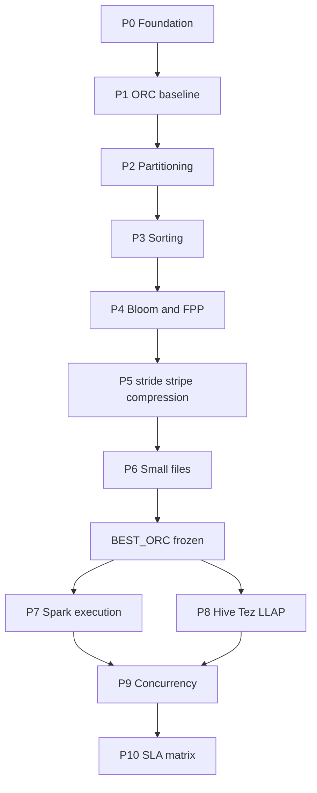

# План реализации и тестирования ORC + HDFS + Spark + Hive

Опираемся на итоговую последовательность из [ORC + HDFS + Spark + Hive benchmark.md](ORC%20+%20HDFS%20+%20Spark%20+%20Hive%20benchmark.md) (§35) и на уже работающий пайплайн `generate → validate → benchmark → report` в [README.md](../README.md). Практический запуск: [cluster_manual_runbook.md](cluster_manual_runbook.md).

**Принцип:** один фактор за раз; cold/warm не смешивать; решения по layout — на Dataset S/M; финальный SLA — на Dataset L (≤100 GB); Hive читает **те же** ORC-файлы, что и Spark.

---

## Что уже есть vs что нужно

| Область | Сейчас в коде | Нужно для документа |
|---|---|---|
| Генерация ORC + partition/bloom/stripe/compression CLI | [`OrcWriter`](../src/main/java/ru/sber/orcbench/writer/OrcWriter.java), [`OrcWriteSettings`](../src/main/java/ru/sber/orcbench/config/OrcWriteSettings.java) | Сортировка при записи; layout-варианты (no/date/hour partition); controllable file size; явный `row.index.stride` |
| Query suite | 10 сценариев в [`BenchmarkScenario`](../src/main/java/ru/sber/orcbench/config/BenchmarkScenario.java) / [`BenchmarkQueries`](../src/main/java/ru/sber/orcbench/benchmark/BenchmarkQueries.java) | Выровнять к Q1–Q10 документа: partition-only, `IN`, column pruning `*` vs projection, JOIN + dictionary, явный cold/warm |
| Метрики | duration, bytes_read, records_read, selectivity | partitions/files read, scan ratio, planning vs execution, shuffle/spill, SLA success rate ≤3s |
| Bloom A/B | [`scripts/run-bloom-ab.sh`](../scripts/run-bloom-ab.sh) | Обобщить до factor-runner (layout × engine × cold/warm) |
| Hive/Tez/LLAP | нет (submit даже отключает Hive tokens) | DDL на external ORC, Beeline/JDBC runner, LLAP cold/warm/cache-size |
| Dataset S/M/L | `--target-size-tb` | **S≈20 GB** (`0.02`), **M≈50 GB** (`0.05`), **L≤100 GB** (`0.1` макс.); HDFS свободно ~700 GB — не копить layout’ы |

Схема AUDEI audit (`epk_id`, `event_ts`, `name`, `channel_type`, `state`, `payload_json`, …) — см. [audei-st-workload-mapping.md](audei-st-workload-mapping.md). Suites: `audei` (interactive SLA), `st` (archive ST mix), `doc` (legacy Q1–Q10 на тех же колонках).

---

## P0 — Foundation (инфраструктура эксперимента)

**Цель:** единый harness для факторных прогонов без изменения логики бенчмарка.

1. Ввести каталог layout’ов на HDFS, например `<base>/layouts/{B0,D1,E1,F1,...}/orc` и `<base>/reports/raw/{layoutId}/`.
2. Расширить отчёт: `layout_id`, `engine`, `cache_state` (cold|warm), `scan_ratio`, `sla_ok` (latency≤3000ms).
3. Скрипт-оркестратор `scripts/run-factor.sh` (или расширение pipeline): generate(layout) → validate → benchmark(N warmups + M measured) → report; N=3–5, M=20–30 на Dataset S; на L — урезать только для тяжёлых full-scan.
4. Зафиксировать protocol cold: clear Spark cache / drop OS page cache где допустимо / restart LLAP later; каждый результат помечать COLD|WARM.
5. Unit-тесты на парсинг layout-id и агрегацию SLA; smoke на `TARGET_SIZE_TB=0.01`.

**Готовность к P1:** smoke проходит; отчёт пишет базовые поля layout/engine/cache_state.

---

## P1 — ORC baseline (этап A документа) + query suite

**Цель:** точка T0 = `ORC-BASE` без Bloom, без sorting, default stride/stripe/compression, indexes ORC включены.

1. Generate: `--orc-bloom-filter-columns=none`, без sort, defaults stride/stripe.
2. Довести suite до покрытия Q1–Q10 документа через существующие/новые сценарии:
   - Q1 partition pruning → filter по partition-колонкам / timestamp day
   - Q2–Q4 equality high/medium/low → уже есть `filter_*_cardinality`
   - Q5 `IN` → новый сценарий
   - Q6 range → `filter_timestamp_range`
   - Q7 column pruning → `projection` vs `full_scan` / `select *` на той же partition
   - Q8–Q9 aggregation → `group_by` (+ heavier variant)
   - Q10 JOIN → генерация маленькой dictionary-таблицы + join-сценарий
3. Метрики: avg/p50/p95/p99, HDFS bytes, rows read, scan ratio.
4. Прогон: Dataset S, затем при необходимости M; baseline зафиксировать как `B0`.

**Критерий:** воспроизводимый baseline-отчёт; pushdown/pruning ещё не тюним — только измеряем.

---

## P2 — Column pruning + Predicate pushdown (этапы B–C)

На **том же** `B0` данных:

1. B: Q7 `SELECT *` vs projection — сравнить bytes/CPU/latency.
2. C0/C1: `spark.sql.orc.filterPushdown` OFF/ON на Q2/Q3/Q5/Q6; снять physical plan.
3. Код: флаги Spark в [`SparkConfigurator`](../src/main/java/ru/sber/orcbench/writer/SparkConfigurator.java) / benchmark runner; не перезаписывать данные.

**Критерий:** C1 bytes_read < C0 на selective queries; column pruning даёт заметный выигрыш из‑за `log_message`.

---

## P3 — Partitioning (этап D)

Три физических копии (один seed/распределение):

- `D0` — без partitionBy
- `D1` — текущая схема `event_year,event_month,event_day` (± `log_format` по решению: для чистоты D1 только date-уровни)
- `D2` — + hour, только если workload часовой

Тесты: Q1, Q2, Q3, Q6, Q8. Метрики: partitions/files selected, planning time, bytes, latency.

**Критерий:** выбрать D\* с лучшим latency/planning trade-off → база для сортировки.

---

## P4 — Sorting (этап E)

Поверх выбранного partitioning:

- `E0` unsorted (текущий generate)
- `E1` sort by high-card column
- `E2` sort by medium
- `E3` sort by timestamp + high

Реализация: `repartition`/`sortWithinPartitions` перед ORC write в generate path; validate проверяет порядок sample или min/max tightness косвенно через bytes на Q2/Q3/Q6.

**Критерий:** зафиксировать E\* с макс. выигрышем min/max pruning (bytes + latency).

---

## P5 — Bloom + FPP (этапы F–G)

Поверх BEST(D,E):

- F0 off / F1 high / F2 medium / F3 high+medium+low  
- G: FPP 0.05 / 0.01 / 0.001 на лучшем наборе колонок  

Уже почти есть [`run-bloom-ab.sh`](../scripts/run-bloom-ab.sh) + [`OrcMetadataInspector`](../src/main/java/ru/sber/orcbench/validation/OrcMetadataInspector.java) — обобщить на F1–F3 и G\*.

Дополнительно: ORC size, write time, index overhead.

**Критерий:** Bloom на high/IN; доказать слабый эффект на low-card; выбрать FPP с приемлемым storage overhead.

---

## P6 — stride / stripe / compression / small files (этапы H–K)

Один фактор за прогон на BEST(D,E,F):

| Фактор | Варианты |
|---|---|
| stride | 5k / 10k / 20k / 50k (нужен явный CLI `orc.row.index.stride` — сейчас есть row-group MB, не stride) |
| stripe | 64 / 128 / 256 MB (уже `--orc-stripe-size-mb`) |
| compression | snappy / zstd / zlib-or-none (уже частично) |
| file size | ~32 / ~256 / ~1 GB через `--target-file-size-mb` / write-partitions |

**Критерий:** зафиксировать `BEST_ORC` (layout + write params). Дальше **данные не менять**.

---

## P7 — Spark execution на BEST_ORC (этапы L–O, частично P–Q)

Только Spark-конфиги, те же файлы:

1. L0/L1 vectorized OFF/ON  
2. M0/M1 AQE (Q8–Q10)  
3. N0/N1 DPP (Q10 + partitioned fact)  
4. O0/O1 CBO + `ANALYZE TABLE` / column stats  
5. P short-circuit — только если worker=DataNode colocated  
6. Q HDFS cache — явные COLD / natural WARM / centralized cache  

Расширить метрики: shuffle, spill, partitions read, plan string (hash/summary).

**Критерий:** профили `S0` baseline Spark и `S1` Spark optimized.

---

## P8 — Hive на тех же ORC (этапы 23–29 документа)

1. External Hive table `STORED AS ORC LOCATION '<BEST_ORC>'` (+ dictionary).  
2. Runner вне текущего fat-JAR или отдельный mode: Beeline/JDBC, те же Q1–Q10 SQL.  
3. H0 Hive+Tez baseline → H1 vectorization → H2 +CBO/ANALYZE → HL cold/warm LLAP → cache-size 25/50/100% hot set.  
4. Минимальная версия Hive для LLAP: ≥2.0; фактическая — из SDP-стека кластера.

**Критерий:** H0–H3 сопоставимы с S0/S1 по latency/bytes/SLA на Dataset M, затем L.

---

## P9 — Concurrency + P10 — SLA

1. Concurrent 1 / 5 / 10 / 25 / 50 (или до целевой нагрузки) для Spark optimized и Hive/LLAP warm.  
2. SLA Success Rate = доля latency ≤3s; не усреднять cold с warm.  
3. Финальная матрица B0…B15 / H0…H4 из §31 документа в markdown/CSV отчёте.

**Критерий успеха:** на Dataset L для целевых interactive queries — высокий SLA success (ориентир документа: p95≲3s, success ≳98%), с разложением «выигрыш layout» vs «выигрыш engine».

---

## Порядок работ в репозитории (кратко)

1. **Harness + метрики + Q5/Q10** (P0–P1) — Java + scripts + тесты.  
2. **Factor scripts для layout** (P2–P6) — CLI generate + `run-factor`; минимум нового Java для sort/stride.  
3. **Spark toggle matrix** (P7) — конфиг-профили в submit/benchmark.  
4. **Hive runner + DDL** (P8) — новый модуль/скрипты; не ломать текущий Spark path.  
5. **Concurrency + SLA report** (P9–P10).

Масштабы прогонов: все факторы на **S** (~20 GB); спорные top-N на **M** (~50 GB); финал S0/S1/H0–H3 + concurrency на **L** (≤**100 GB**). Перед L очищать лишние `layouts/*` (на кластере ~700 GB свободно).

---

## Риски

- Hive/LLAP может быть недоступен или иной версии на SDP — P8 стартует с inventory версий Tez/Hive/LLAP.  
- Short-circuit / HDFS centralized cache требуют admin-доступа — помечать N/A, не блокировать BEST_ORC.  
- 20–30 repeats × много layout’ов дорого по времени и **месту на HDFS** (~700 GB свободно, макс. датасет 100 GB) — жёстко резать матрицу после S (только победители факторов) и удалять проигравшие layout’ы перед M/L.
